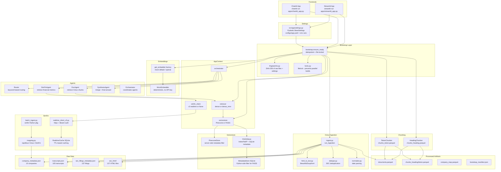

# Architecture

## System Overview



## Data Flow

```
Raw JSON/HTML → [Ingestion] → documents.parquet
                           → ingest_report.parquet

documents.parquet → [Chunking] → chunks_heading.parquet
                              → chunks_token.parquet

chunks_*.parquet → [Embedding] → [Vectorstore: Pinecone or FAISS]

User Query → [Router] → DocAgent → [Retriever] → [Vectorstore]
                     → SimFinAgent → [SimFin API / DuckDB]
                     → SynthesisAgent → SynthesisResult
                                        ├── final_answer_text
                                        ├── citations[]
                                        └── trace_events[]
```

## Storage Architecture

| Store | Purpose | Technology |
|-------|---------|-----------|
| `documents.parquet` | Normalized Octus documents | Apache Parquet (pyarrow) |
| `chunks_*.parquet` | Chunked text for retrieval | Apache Parquet (pyarrow) |
| `simfin.duckdb` | SimFin financial statements | DuckDB (embedded SQL) |
| `company_map.parquet` | Octus→SimFin ticker mapping | Apache Parquet |
| Pinecone index | Vector embeddings (primary) | Pinecone serverless |
| FAISS index | Vector embeddings (fallback) | FAISS IndexFlatIP |
| `metadata.sqlite` | FAISS chunk metadata | SQLite |
| `embedding_cache.sqlite` | Embedding cache | SQLite |
| `simfin_realtime_cache.sqlite` | SimFin API response cache | SQLite |
| `.bootstrap.lock` | Build mutex | filelock |
| `bootstrap_manifest.json` | Fingerprint + build metadata | JSON |
